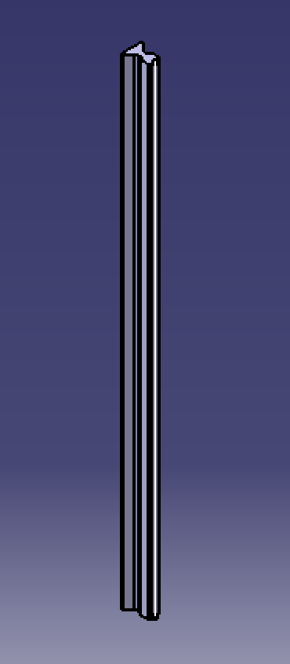
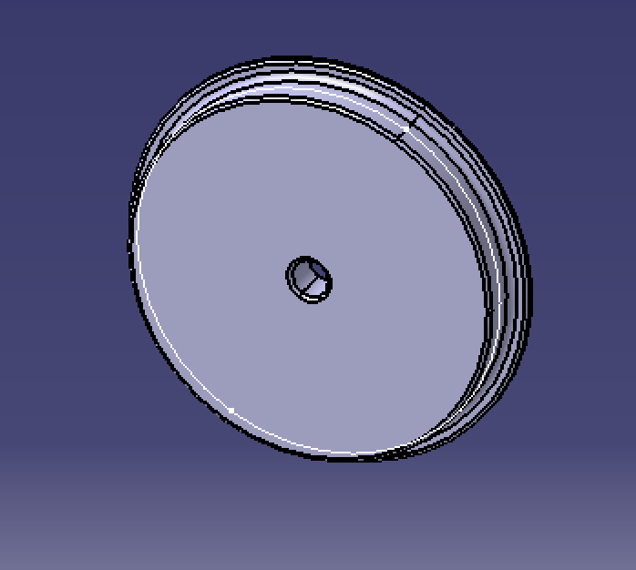
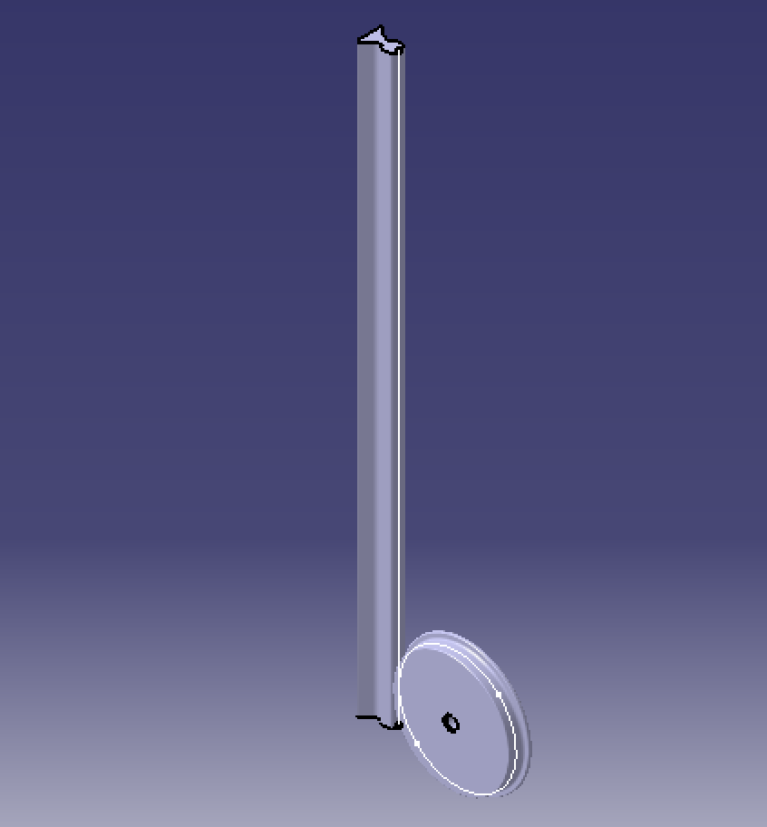

# Roll Curve Joint Design in CATIA V5

## Overview

This project presents a **Roll Curve Joint** designed and assembled using **CATIA V5**. The assembly demonstrates accurate CAD modeling, assembly constraints, and rolling contact between mechanical components. It showcases the principles of constrained motion and kinematic relationships used in modern mechanical systems.

The project emphasizes precision component design and practical mechanical assembly techniques commonly used in machine design and engineering applications.

---

## Project Objectives

- Design individual components of a roll curve joint
- Develop a complete mechanical assembly
- Apply assembly constraints in CATIA V5
- Demonstrate rolling motion between mating components
- Improve CAD modeling and mechanical design skills

---

## Features

- Complete roll curve joint assembly
- Accurate 3D CAD modeling
- Rolling contact mechanism
- Fully constrained assembly
- Precision mechanical design
- Industrial CAD workflow

---

## Software Used

- CATIA V5

---

## Applications

- Mechanical Motion Systems
- Machine Design
- Industrial Automation
- Kinematic Mechanisms
- Mechanical Engineering Education
- CAD Learning and Training

---

## Skills Demonstrated

- CATIA V5
- CAD Modeling
- Assembly Design
- Mechanical Design
- Machine Design
- Kinematic Mechanisms
- Engineering Graphics
- Constraint Management

---

# Project Gallery

## Rail

---

## Wheel

---

## Complete Roll Curve Joint Assembly

---

## Author

**Parth**

B.E. Mechatronics Engineering

Savitribai Phule Pune University
